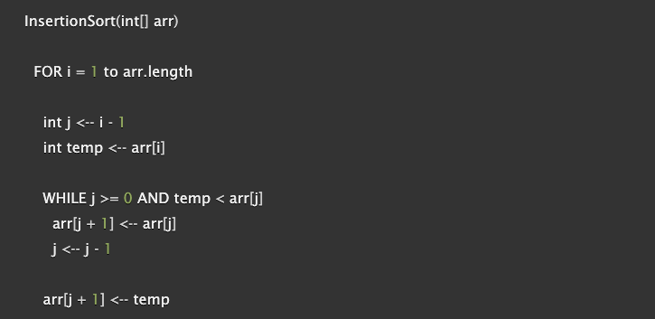
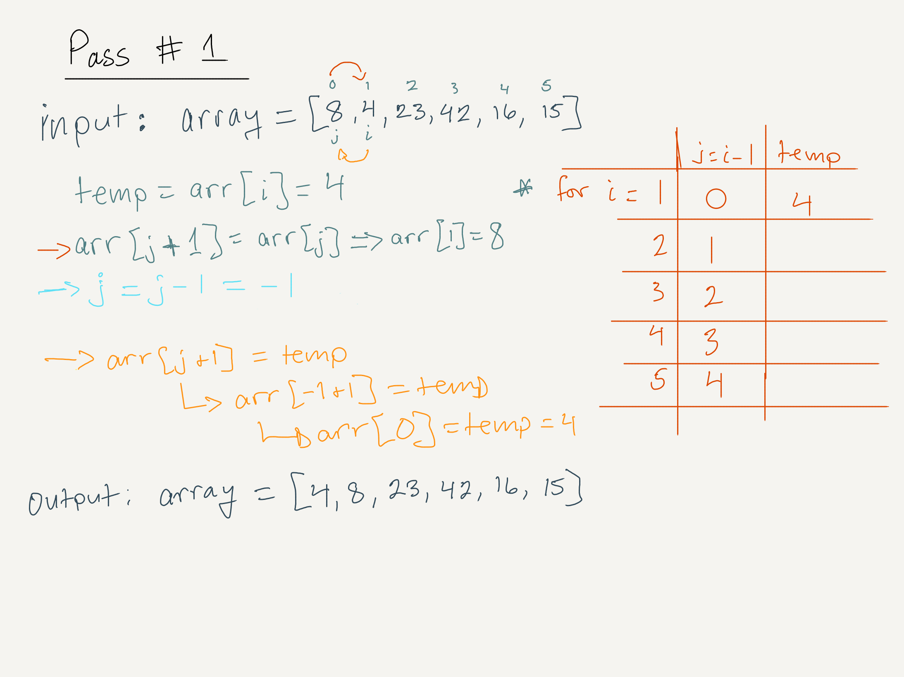
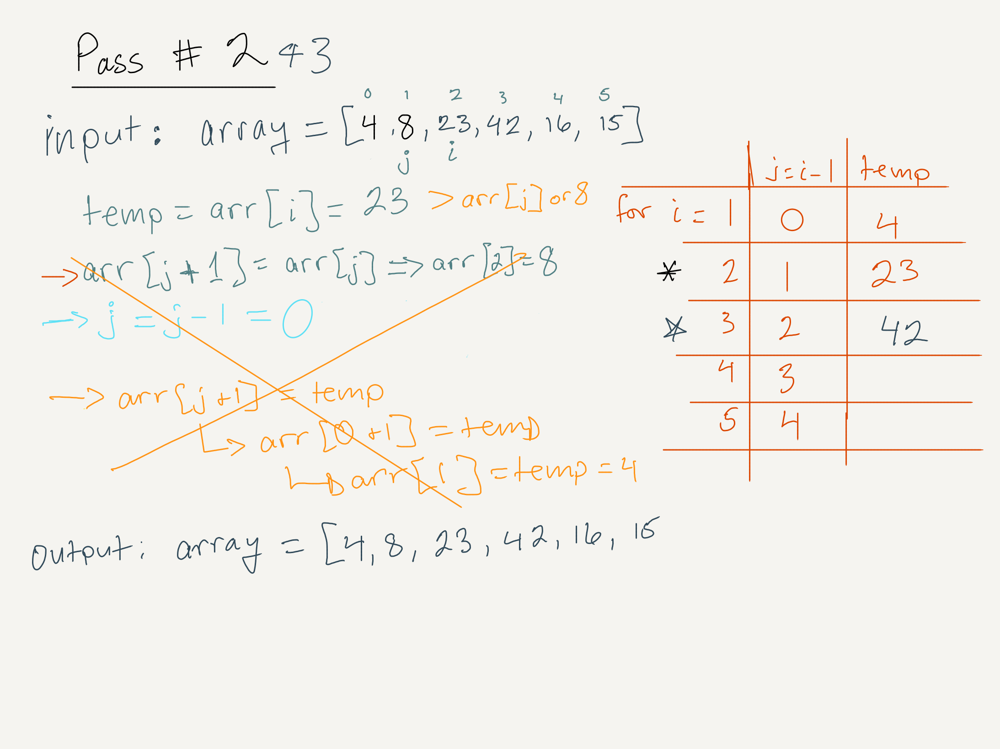

# Code Fellows 401 JavaScript: Code Challenge for Class 26 (11 January 2020)

## Author: Nathan Rhead Cox

## Prompt: Write a blog post tracing out an algorithm in words and diagrams for the followiwng pseudo-code of a function that sorts an array of integers in ascending order.

## Algorithm

Input: array = [8,4,23,42,16,15].
Output: array = [4,8,15,16,23,42].

Pass 1: A for-loop is introduced, with i starting at index 1 of the array and looping until i is less than or equal to the array's length. A variable j is declared and set equal to i - 1: in the first pass it will manage the value at an index of zero. Then, a temp variable is assigned to the value of the array at i, in this case to the value of the array at an index position of one. A while-loop is introduced within the for-loop, to run until j is less than 0 and the temp variable is greater than the value of the array at j. In the while-loop, the value of the array at j + 1 is set to the value of the array at j, effectively replacing the first value of the array--which is being held in the temp variable--with the second value. Then, j is reduced by one and the array at j + 1 is set to the value of the temp variable, effectively setting the former value of the array at zero to its value at one. This exercise swapped the first and second values of the array and will continue to do so, as long as the temp variable is less than the array at j. When it's not, the while loop will break and the for loop will iterate i and j by one.

Pass 2 & 3: In these passes, the while-loop will fail to run because j is greater than or equal to zero AND the value of the temp variable (23 and 42, respectively) is greater than the value of the array at j (8 and 23 respectively).

Passes 4 & 5: these will follow the schema laid out in the first visual, with 16 first swapping spots with 42 and then with 23, before settling in at index position 2, and 15 following suit. 

## Efficiency

- Time = O(n^2): The comparison happens n * (n-1) number of time, making the algorithm n-squared for time.
- Space: O(1): The array is sorted in place, so no new array is created, making the space used constant.
