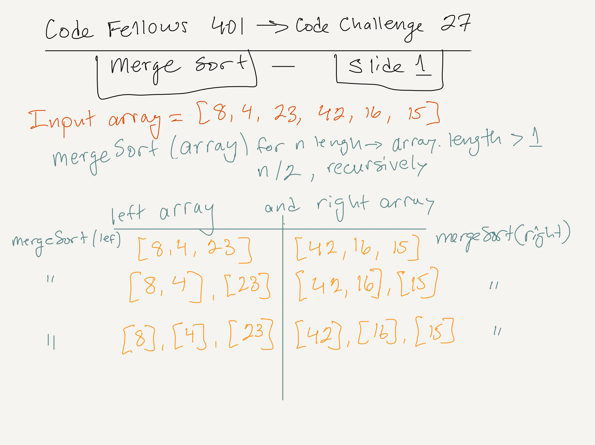
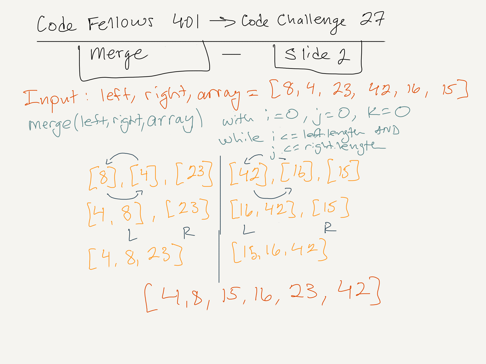

# Code Fellows 401 JavaScript: Code Challenge for Class 27 (12 January 2020)

## Author: Nathan Rhead Cox

## Prompt

Review the pseudocode below, then trace the algorithm by stepping through the process with the provided sample array. Document your explanation by creating a blog article that shows the step-by-step output after each iteration through some sort of visual. Once you are done with your article, code a working, tested implementation of Merge Sort based on the pseudocode provided.

```
ALGORITHM Mergesort(arr)
    DECLARE n <-- arr.length
           
    if n > 1
      DECLARE mid <-- n/2
      DECLARE left <-- arr[0...mid]
      DECLARE right <-- arr[mid...n]
      // sort the left side
      Mergesort(left)
      // sort the right side
      Mergesort(right)
      // merge the sorted left and right sides together
      Merge(left, right, arr)

ALGORITHM Merge(left, right, arr)
    DECLARE i <-- 0
    DECLARE j <-- 0
    DECLARE k <-- 0

    while i < left.length && j < right.length
        if left[i] <= right[j]
            arr[k] <-- left[i]
            i <-- i + 1
        else
            arr[k] <-- right[j]
            j <-- j + 1
            
        k <-- k + 1

    if i = left.length
       set remaining entries in arr to remaining values in right
    else
       set remaining entries in arr to remaining values in left
```

## Algorithm

Input: array = [8,4,23,42,16,15].
Output: array = [4,8,15,16,23,42].

Concept: to divide the array by two recursively into "right" and "left" arrays until the arrays are no longer divisible by two (i.e., array.length <= 1).

Then, to compare the "right" and "left" sides--meaning each number to each--and place them in ascending order.

Slide 1 represents the first half of this process, where the input array is divided recursively into halves of havles of havles until array.length <= 1.



Slide two represents the second half of the process, where each left and right are compared at the same index and moved down according to which is smaller.



Since there will be one number left over, the array must be appended with both the left and right to ensure a full collection.

## Efficiency

- Time = O(n^2): The comparison happens n * (n-1) number of times, making the algorithm n-squared for time.
- Space: O(1): The array is sorted in place, so no new array is created, making the space used constant.

## References

- ["Merge Sort Algorithm in JavaScript"](https://medium.com/javascript-in-plain-english/javascript-merge-sort-3205891ac060)
