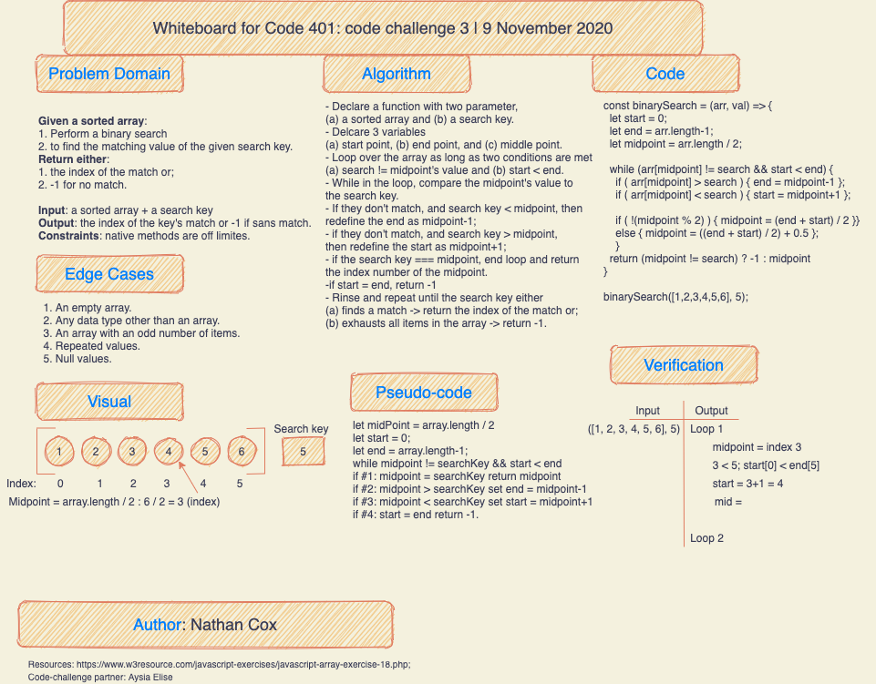

# Binary search in a sorted 1D array

- This is the code challenge for class 03 of Code Fellows 401.
- The task is to whiteboard the solution to the task to find the value in a given sorted array that matches a search key withou using any native JS methods.

## Challenge

- Whiteboard with a partner the solution to the task to find the value in a given sorted array that matches a search key withou using any native JS methods.
- Partner = Aysia Elsie.

## Approach & Efficiency

- I used app.diagram.net and the template provided by Code Fellows to define the problem domain, describe in plain language the steps to take to solve the problem, draw up a visual of the solution, write out the code, and describe the steps I'd take to verify the solution.
- Aysia didn't seem too keen to work with a partner, and when I talked to her about it, she admitted that it's hard for her, being an introvert.
- We worked out a solution together, based on one that we found on the internet, but she did her own whiteboard--she couldn't share it because it was on her iPad and she hasn't yet figured out how to do that.
- We got close to the correct solution, though we wouldn't have had we not tested in an editor. 

## Solution

[Coded Solution](array-binary-search.js)

