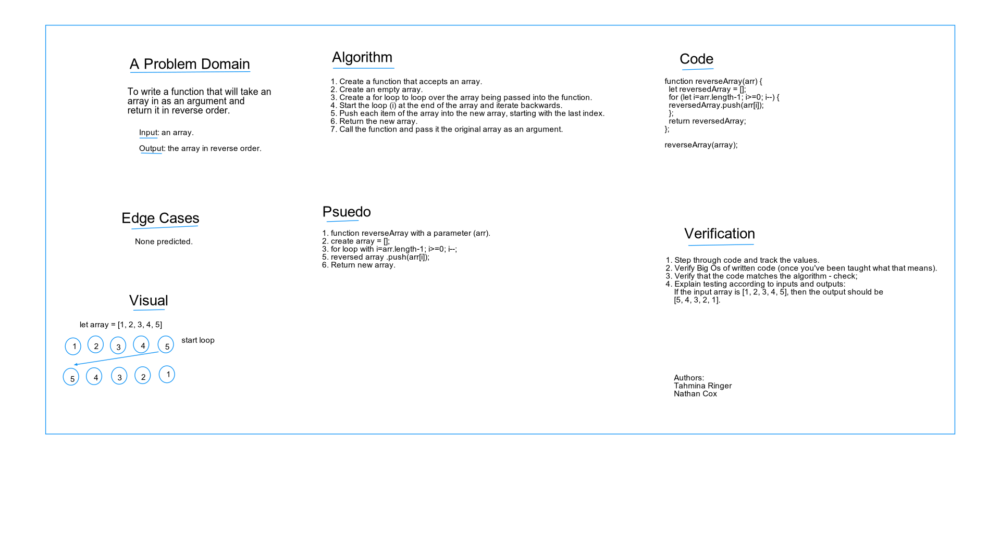

# Reverse an Array

- This is the code challenge for class 01 of Code Fellows 401.
- The task is to whiteboard the solution to reversing the contents of an array.
- This is our first introduction to white-boarding, a skill we'll need for interviews and on the job.

## Challenge

- Whiteboard with a partner the solution to reversing the contents of an array without using methods native to JavaScript.
- Partner = Tahmina Ringer.

## Approach & Efficiency

- We used--and would not recommend--the AWW App online whiteboard and the template provided by Code Fellows to define our problem domain, describe in plain language the steps we'd take to solve the problem, draw up a visual of the solution, write out the code, and describe the steps we'd take to verify the solution.

- While we haven't yet covered the Big O in class, per our current understanding, our code is as pithy as it could be in vanilla JavaScript.

## Solution

