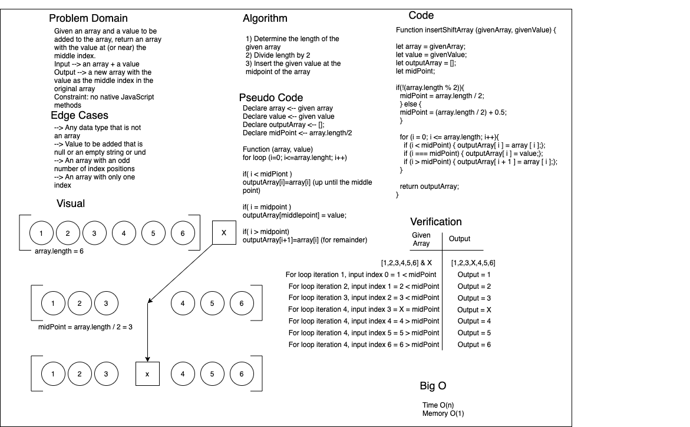

# Reverse an Array

- This is the code challenge for class 02 of Code Fellows 401.
- The task is to whiteboard the solution to adding a value to the midpoint of a given array without using any native JS methods.

## Challenge

- Whiteboard with a partner the solution o adding a value to the midpoint of a given array without using any native JS methods.
- Partner = Simon Panek.

## Approach & Efficiency

- We used--and would not recommend, though it was a little less clunky than the AWW App online whiteboard--app.diagram.net and the template provided by Code Fellows to define our problem domain, describe in plain language the steps we'd take to solve the problem, draw up a visual of the solution, write out the code, and describe the steps we'd take to verify the solution.
- While we haven't yet covered the Big O in class, per our current understanding, our code is as pithy as it could be in vanilla JavaScript sans native JS methods.
- Without coding the problem out in an editor, we'd never have been able to talk our way to the correct solution, because we would have overlooked a couple of big problems. We're hopeful that, with practice whiteboarding, this will change.

## Solution

[Coded Solution](array-shift.js)

