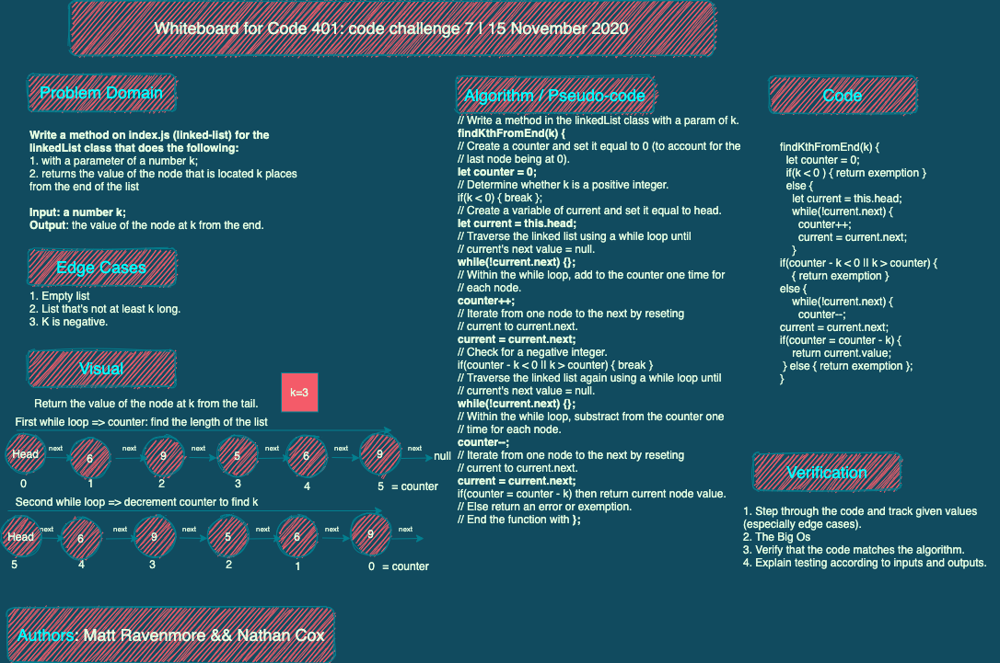

# Singly and Doubly Linked Lists

## Challenge 05

Create an empty linked list and then populate it with nodes added to the head; search for the presence of a value in the list; output a string of objects representing the value of each node.

### Whiteboard 05 - None Required

## Challenge 06

Add methods to the linkedList class that (a) append a new node to the end of the list; (b) insert a new node before a node with a given value; (c) insert a new node after a node with a give value. Write tests for each method.

### 

## Challenge 07

Return the node k places from the tail (with the last node occupying the zero position).

### 

## Challenge 08

Zip two linked lists, alternating nodes and maintaining Big O at lowest possible levels.

### 

## Challenge: reverse a doubly linked list

### 

## Approach & Efficiency

Big O is either 0(1) or 0(n).

## API

- [x] prepend: insert a node either as the first entry in an empty list or as an additional entry at the head of the list.

- [x] append: add a node at the end of the list.

- [x] includes: search for the presence of a given value in the list, returning true if it is found and false if not.

- [x] toString: return a string of objects of all values in the list, including null (to indicate the end of the list).

- [x] insertBefore: add a node before a given node.

- [x] insertAfter: add a node after a given node.

- [x] kthFromTheEnd: return the value of the node that is k places from the tail.

- [x] removeDuplicates: return the list sans duplicate values.

Additional methods added

- [x] reverse: return the linked list fully reversed.

- [x] printList: return the values of the list as an array in the order that they appear from head to tail.

