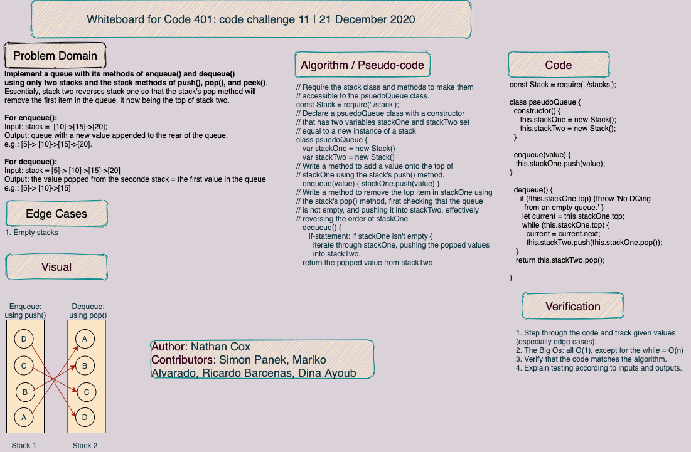

# Queue from Stacks | CF 401 Challenge 11

## Task

Implement a queue with its methods of enqueue() and dequeue() using only two stacks and the stack methods of push(), pop(), and peek().

- For enqueue():
Input: stack =  `[10]->[15]->[20]`.
Output: queue with a new value appended to the rear of the queue.
e.g.: `[5]-> [10]->[15]->[20]`.

- For dequeue():
Input: stack = `[5]-> [10]->[15]->[20]`.
Output: queue with a value removed from the front of the queue.
e.g.: `[5]-> [10]->[15]`.

## Approach & Efficiency

- Solution 1: Using a Stack Class
Big O for space: O(n) for the creation of a stack of n length. (The second stack gets filled by popping things of the first stack.)
Big O for time: O(1) when enqueuing before any dequeueing; O(n) for the while-loop through which runs n times when dequeueing.

- Solution 2: Using Arrays as Stacks
Big O for space: O(n).
Big O for time: O(1) for enqueueing before dequeueing, but O(n) for enqueueing after a dequeue and for dequeueing because of the for-loop.

## API: A description of each method publicly available to your queue.

- push: takes any value as an argument and adds a new node with that value to the top of the stack--but (somehow) to the end of the queue--with an O(1) time performance.

- pop: takes no argument; removes the node from the top of the stack--the front of the queue--and returns the node’s value, raising an exception on an empty queue.

- peek: takes no argument; returns the value of the node located on top of the stack--or the front of the queue--without removing it from the stack, raising an exception on an empty queue.

## 
