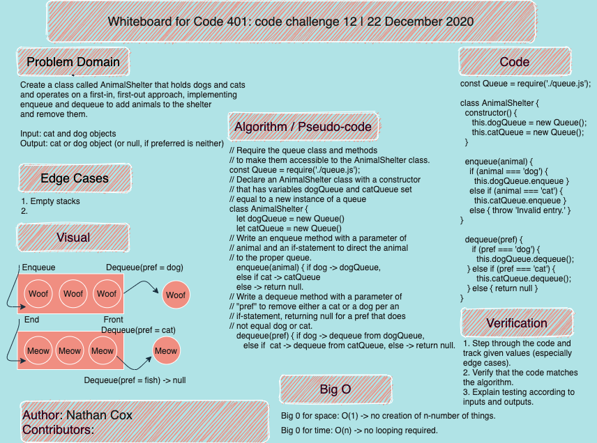

# FIFO Animal Shelter

- This is the code challenge for class 12 of Code Fellows 401.
- The task is to create a class called AnimalShelter that holds only dogs and cats. The shelter operates using a first-in, first-out approach and implements the following methods:
  - enqueue(animal): adds an animal to the shelter. The animal may be either a dog or a cat object.
  - dequeue(pref): returns either a dog or a cat. If pref is not "dog" or "cat" then return null.

## Challenge

- Whiteboard with a partner the solution, determining approaches to testing and Big O for space and time.
- Write the code and tests for it.
- Timebox of two hours.

## Approach & Efficiency

- Big O for space: 0(1).
- Big 0 for time: 0(1).

## Solution

[Coded Solution](./fifo-animal-shelter.js)
