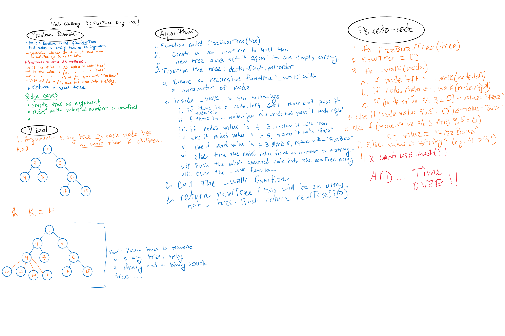

# Binary Tree & BST Implementation: Challenge 18

## Whiteboard the traversal of a k-ary Tree
  
- (This challenge was amended to exclude the writing of code and tests, requiring only a whiteboard, with the challenge to be limited to forty-five minutes maximum.)

- The Problem domain: Write a function called FizzBuzzTree which takes a k-ary tree as an argument and returns a new tree per the following conditions.
  - Without utilizing any of the built-in methods available to your language, determine whether or not the value of each node is divisible by 3, 5 or both. Create a new tree with the same structure as the original, but the values modified as follows:
    - If the value is divisible by 3, replace the value with “Fizz”
    - If the value is divisible by 5, replace the value with “Buzz”
    - If the value is divisible by 3 and 5, replace the value with “FizzBuzz”
    - If the value is not divisible by 3 or 5, simply turn the number into a String.

## Approach & Efficiency

- I don't yet know how to traverse anything but a binary tree. 
- But I do know that the k-ary tree will need to be traversed n number of times to review each node's value and apply the above conditions to it.
- Plus, the return is the creation of a new tree.

- As such, big O for time will be O(n) and big O for space will be O(n), I think.

## Solutions

Not required

### Challenge 18

