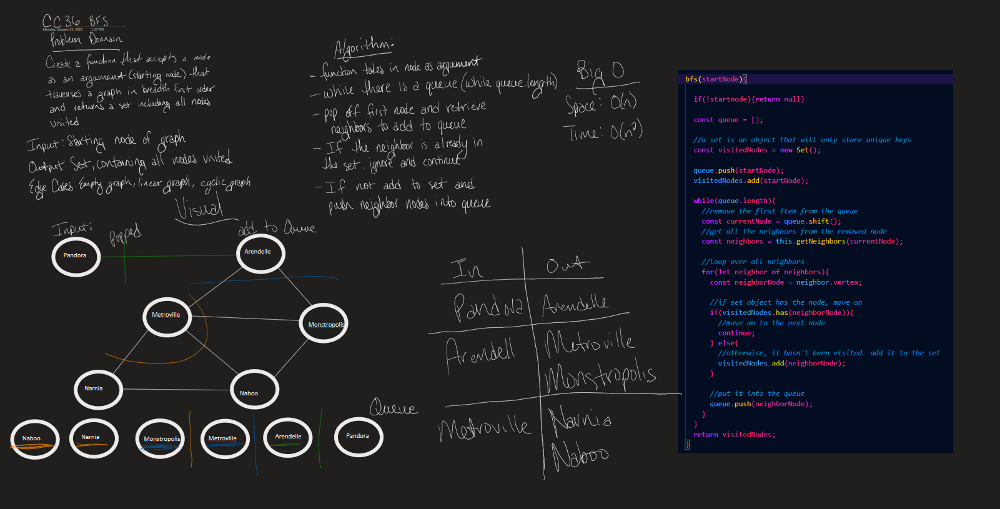
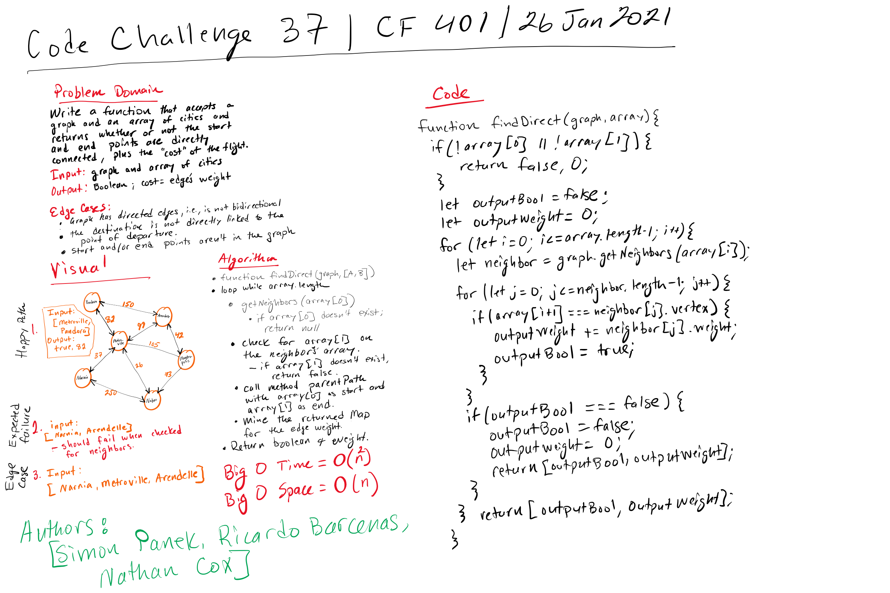
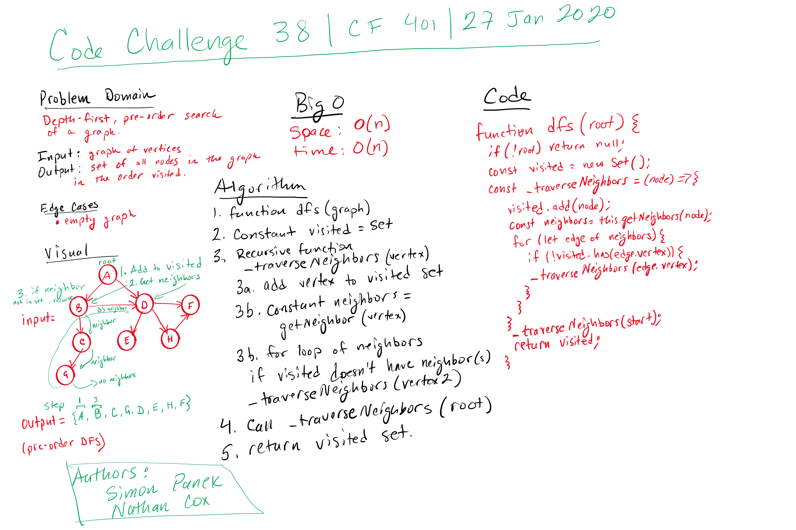

# Create a Graph Implementation: Code Challenges 35 - 38

## Code Challenge 35 Features

- Implement your own Graph. The graph should be represented as an adjacency list and should include the following methods:

  - [x] addVertex()
    - [x] Adds a new node to the graph.
    - [x] Takes in the value of that node.
    - [x] Returns the added node.
  
  - [x] ddEdge()
    - [x] Adds a new edge between two nodes in the graph.
    - [x] Includes the ability to have a “weight”.
    - [x] Takes in the two nodes to be connected by the edge.
    - [x] Both nodes should already be in the graph.
  
  - [x] getMap(): Returns all of the nodes in the graph as a collection (set, list, or similar).
  
  - [x] getNeighbors()
    - [x] Returns a collection of edges connected to the given node.
    - [x] Takes in a given node.
    - [x] Includes the weight of the connection in the returned collection.
  
  - [x] size(): Returns the total number of nodes in the graph.

### Code Challenge 35: Testing

- Write tests to validate the following functionality:

  - [x] Node can be successfully added to the graph.
  - [x] An edge can be successfully added to the graph.
  - [x] A collection of all nodes can be properly retrieved from the graph.
  - [x] All appropriate neighbors can be retrieved from the graph.
  - [x] Neighbors are returned with the weight between nodes included.
  - [x] The proper size is returned, representing the number of nodes in the graph.
  - [x] A graph with only one node and edge can be properly returned.
  - [x] An empty graph properly returns null.

## Code Challenge 36: Features

Extend your graph object with a breadth-first traversal method that accepts a starting node. Without utilizing any of the built-in methods available to your language, return a collection of nodes in the order they were visited. Display the collection.

### Authors: Simon Panek, Ricardo Barcenas, Nathan Cox

### Code Challenge 36: Testing

- [x] It returns a set of values of the nodes in a graph in a breadth-first search.
- [x] It returns a collection of vertices from a linear graph.
- [x] It returns null for an empty graph.

## Code Challenge 37: Features

Write a function based on the specifications above, which takes in a graph, and an array of city names. Without utilizing any of the built-in methods available to your language, return whether the full trip is possible with direct flights, and how much it would cost.

### Authors: Simon Panek, Ricardo Barcenas, Nathan Cox

### Code Challenge 37: Testing

- [x] It returns true if two vertices are directly connected, as well as the weight of the edge between them.
- [x] It returns true if three vertices are directly connected to at least one of the other, as well as the combined weight of the edges between them.
- [x] It returns true if two vertices are directly connected, as well as the weight of the edge between them, regardless of what the points of departure and arrival are.
- [x] It returns false when the two vertices passed as arguments are not connected by an edge.

## Code Challenge 38: Features

Create a function that accepts an adjacency list as a graph, and conducts a depth first traversal. Without utilizing any of the built-in methods available to your language, return a collection of nodes in their pre-order depth-first traversal order.

### Authors: Simon Panek, Nathan Cox

### Code Challenge 38: Testing

- [x] It returns a pre-ordered set after a depth-first search.
- [x] It returns a pre-ordered set after a depth-first search, in a different order than the happy path, since dfs will start with the neighbor first added in the root.
- [x] It returns null if the graph is empty.

## Approach & Efficiency

- Big O for time: for a breadth-first search, since it's a loop within a loop, time is O(n^2); for the depth-first approach, which is recursive, time is O(n), since it's possible that each node will have to be traversed.
- Big O for space: since everything depends on the creation of a new Vertex instance, this is at least O(1). However, since the graph is a map of n number of vertices, space for it, as for an array, will be O(n).

## Solutions

[Code Challenge 35-38](./graph.js)

