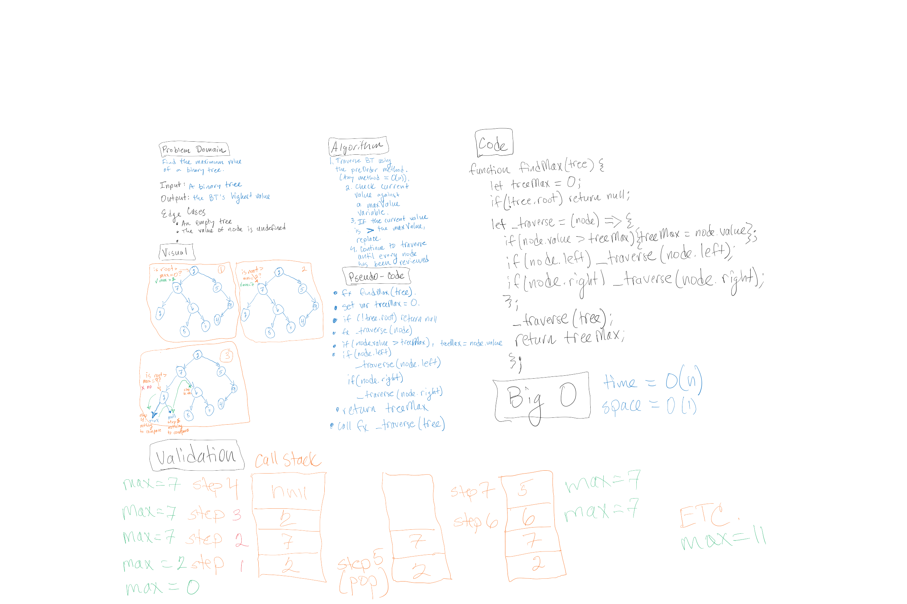

# Binary Tree & BST Implementation: Challenges 15 & 16

- Code challenge 15:
  - to create a Node class that has properties for the value stored in the node, the left child node, and the right child node;
  - to create a BinaryTree class;
  - to define a method for each of the depth first traversals called preOrder, inOrder, and postOrder which returns an array of the values, ordered appropriately;
  - to handle any exceptions or errors that come from your code semantically, with capturable errors. For example, rather than a default error thrown by your language, your code should raise/throw a custom, semantic error that describes what went wrong in calling the methods you wrote for this lab;
  - to create a BinarySearchTree class;
  - to define a method named add that accepts a value, and adds a new node with that value in the correct location in the binary search tree.
  -to define a method named contains that accepts a value, and returns a boolean indicating whether or not the value is in the tree at least once.

- Code Challenge 16: extend the binary tree class with a method that returns the maximum value of the tree.

## Challenge

- Write the code and tests for it.
- Do it all over Christmas break, only referring to the videos and reading material provided. (This would be easier, I feel like, if we were getting paid to learn on our own.)

## Approach & Efficiency

### Challenge 15
- Big O for space: not yet known.
- Big O for time: not yet known.

### Challenge 16
- Big O for space: O(1): a variable maxTree is created.
- Big O for time: O(n): the preOrder method has a height of log n, so time is O(h).

## Solution

### Challenge 15
- No whiteboard required.
[Code 15 Solution](./tree.js): no solution yet found.

### Challenge 16
;
[Code 15 Solution](./tree.js).
