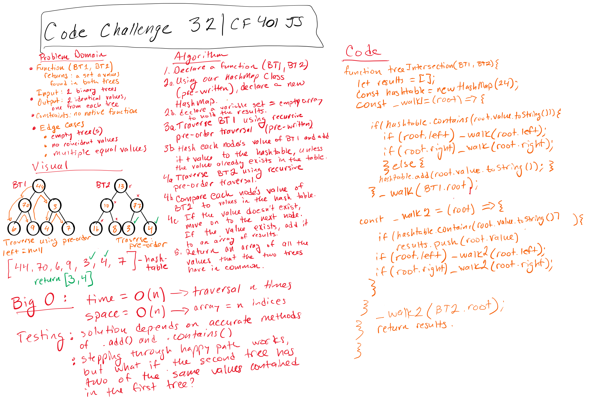

# Find common values in 2 binary trees.

## Code challenge 32
  
Write a function called tree_intersection that takes two binary tree parameters.
Without utilizing any of the built-in library methods available to your language, return a set of values found in both trees.

## Approach & Efficiency

- Big O for space: O(n).
- Big O for time: O(n).

## Solutions

[Solution](./tree-intersection.js)
